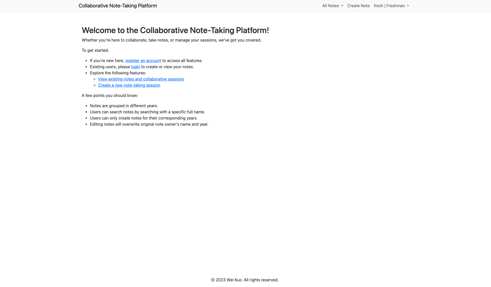

# Flask-MongoDB Web App - Collaborative Note-Taking Platform  
*This is a simple web-app created for practice purpose*
## 0. App Demo:

## 1. App Description:
Users can create, view, edit, and delete notes based on their grade level on this app. New users can register using their name, grade, email, and password. Upon registration, users can log in to create, view, edit, and delete notes. The platform supports user sessions and year-based note segregation. Users can search for notes by specifying the creator's full name. 

## 2. App Creation:
Built using Python with the Flask web framework, the app leverages MongoDB as its database for data storage. It incorporates Flask's templating system to render dynamic HTML pages and features robust user authentication, ensuring secure access to personalized functionalities. The code follows a modular structure, promoting maintainability and scalability.

## 3. App Functionality:
The platform includes the following functionalities:
- **Registration**: New users can register by providing their name, grade, email, and password.
- **Login**: Registered users can log in using their email and password.
- **Note Creation**: Users can create new notes with their full name, grade, and a message.
- **Note Viewing**: Users can view notes created by users belonging to a specific grade or all grades.
- **Note Editing**: Users can edit their own notes.
- **Note Deletion**: Users can delete their own notes.
- **Search Functionality**: Users can search for notes by specifying the creator's full name.
- **Webhook for Auto-update**: Includes a webhook route that triggers a `git pull` command to update the app's codebase. 

Website link: [Collaborative Note-Taking Platform](https://i6.cims.nyu.edu/~ck3294/7-web-app-WeiKuoWei/flask.cgi/)  
